<!-----

You have some errors, warnings, or alerts. If you are using reckless mode, turn it off to see inline alerts.
* ERRORs: 0
* WARNINGs: 0
* ALERTS: 15

Conversion time: 5.494 seconds.

Using this Markdown file:

1. Paste this output into your source file.
2. See the notes and action items below regarding this conversion run.
3. Check the rendered output (headings, lists, code blocks, tables) for proper
   formatting and use a linkchecker before you publish this page.

Conversion notes:

* Docs to Markdown version 1.0β33
* Thu Feb 10 2022 12:01:46 GMT-0800 (PST)
* Source doc: Lab 1 Design.md
* Tables are currently converted to HTML tables.
* This document has images: check for >>>>>  gd2md-html alert:  inline image link in generated source and store images to your server. NOTE: Images in exported zip file from Google Docs may not appear in  the same order as they do in your doc. Please check the images!

----->

Megan Maley & Betsy Ding 

Lab 1: Our Task List Walk Through

For our final design, we decided to format each frame in each HTML page with a pale off-white background and thin black border, with blue text and icon elements. To fit the blue and black theme, we chose a neutral blue Optima font for the header and black Avenir font for the checklist items. We based these style choices on Dr. Milburn’s design and color theory lecture, and drew inspiration from two interfaces we enjoyed: the Kaiser Permanente mobile site and the Apple Reminders application. Kaiser’s health-focused concept and the Reminders app’s straightforward organization of day-to-day tasks embody how we wanted users to make use of the app.

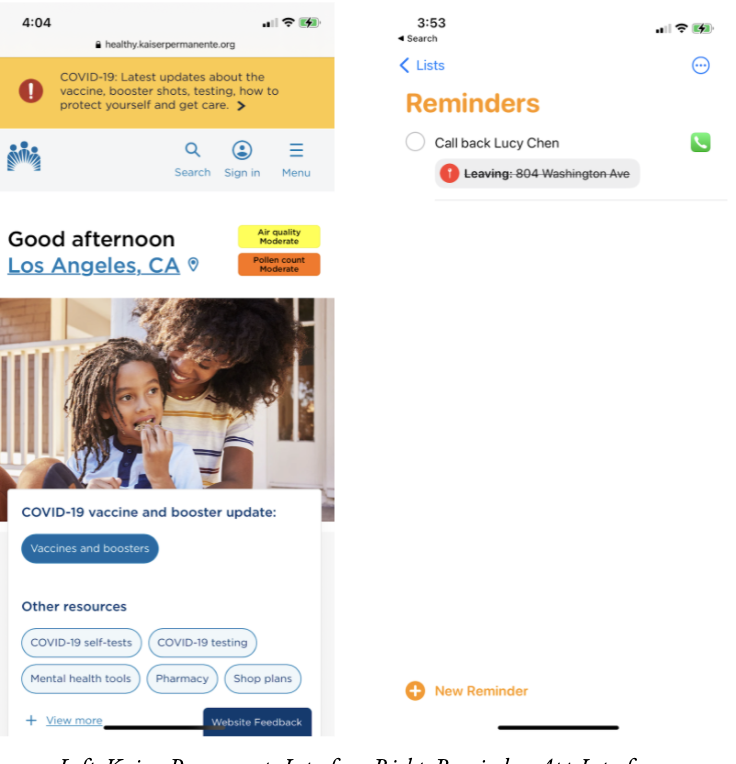
        

_Left: Kaiser Permanente Interface; Right: Reminders App Interface_

Before going forward with these style and design elements, we sketched out a rough flow chart of the sequence of how each page should look before, during, and after each task:

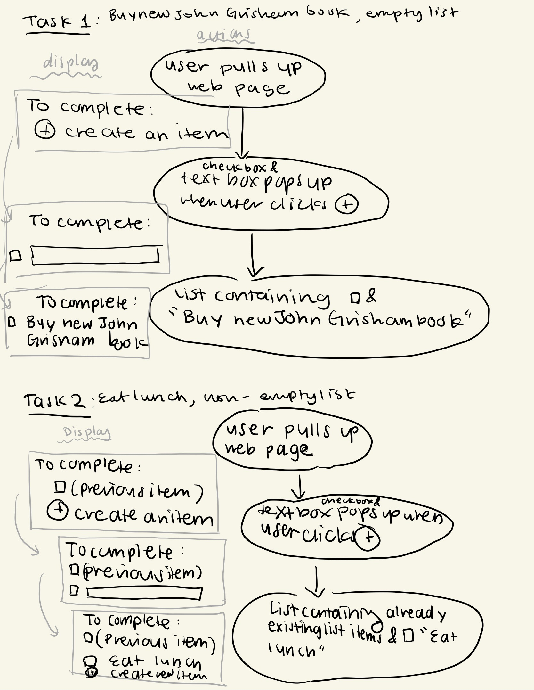

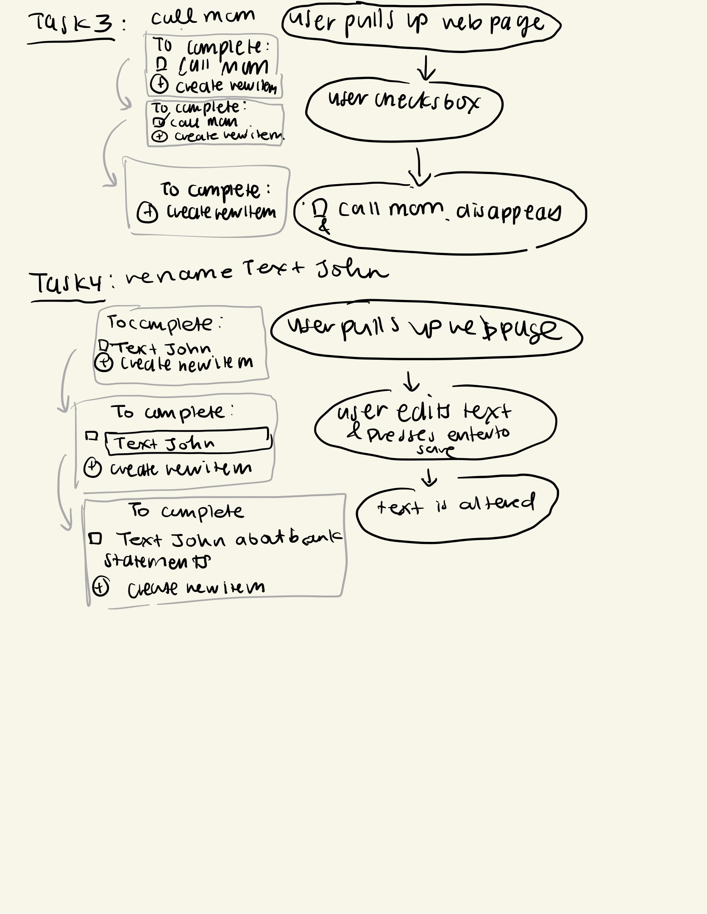

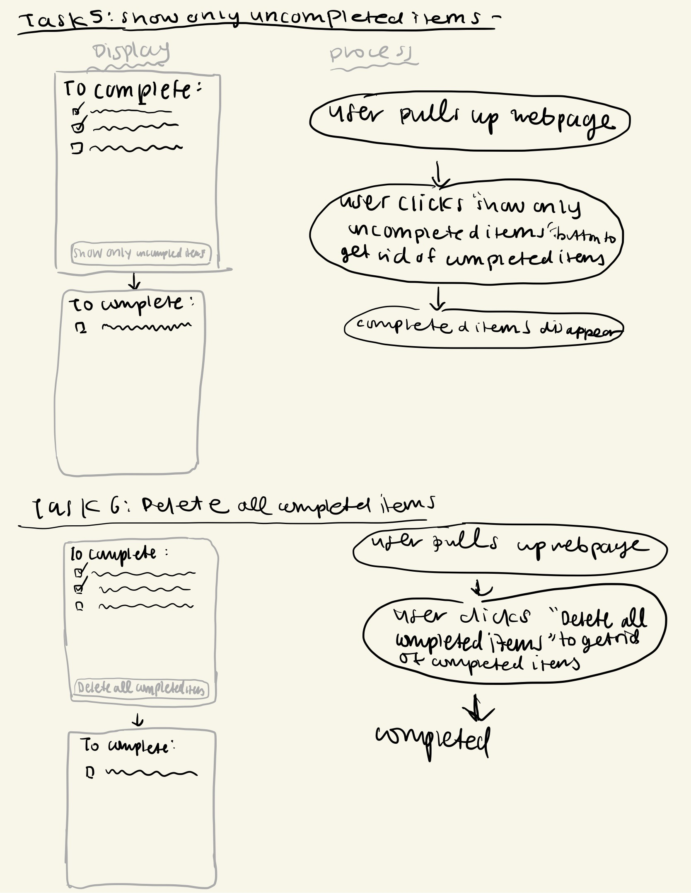

_Rough flowchart with display sketch on left in gray boxes  and user interactions on right in black circles_

With these flowcharts and these two interfaces as inspiration, our first design looked like this:

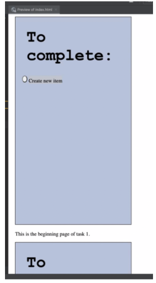

_Our first design with violet blue background, Courier font, and Times New Roman Font_

We liked the calming and blue, white, and black color schemes of the Kaiser interface which is why we filled each frame with a violet blue background. After this first prototype, we then tweaked several elements: we shifted the left alignment of the checklist items to match the “To complete: ,” as Dr. Milburn explained that consistent alignment evokes a clean feel, and that a left alignment is the most natural arrangement for Western audiences.  For the checklist items, we exchanged Times New Roman for Avenir for a sleeker rather than traditional feel. In this next prototype, we allowed the item text and the plus button turn gray when the user’s cursor on the desktop hovers over the button to indicate that the user has the ability to edit the contents of the text:

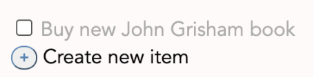

_Items in List turns gray when cursor hovers over text_

The most difficult part of our design process was implementing the plus button to the left of the “Create new item” element. Our original button was square, but we wanted rounded buttons like the Kaiser and Reminders interfaces. At first, we struggled to figure out how to add the “+” into the vacant square button. After consulting Grutor Arisa, we realized we could label the button with “+”  and make the button rounded by using the radius CSS tag. To match the blue theme, we changed the border color and “+” of the button to be blue. Some iterations of the button were too elliptical or too square, but after much trial and error, we finally found the perfect numerical value. This button process took us several days to fully finalize, which is why the plus button is our proudest accomplishment in this lab. 

_Final plus button with round shape and blue theme _

When we shared this prototype with Professor Rhodes, he noted several design features that interested him. One major aspect he pointed out to us was that the “To complete:” took up two lines, making the reading experience a bit inconvenient for the user. Thus, we altered the font size to be smaller and fit on one line, which we both agreed felt more comfortable. 

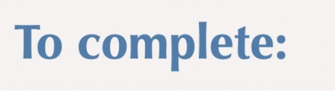

_Final header in Optima font, fit on one line_

After finalizing our design and pushing it onto GitHub, we tested this design on 4 users. According to the course reading, _Don’t Make Me Think_, Kruger argues that the first 3-5 users will uncover many of the biggest problems with the interface. 

These were the responses from the user testing: 

<table>
  <tr>
   <td><strong>Participant #</strong>
   </td>
   <td><strong>Name of Participant</strong>
   </td>
   <td><strong>Verbal Feedback Notes</strong>
   </td>
  </tr>
  <tr>
   <td>1
   </td>
   <td>Andrew 
   </td>
   <td>
<ul>

<li>Opened up on google pixel, set up looks different

<li>Font looks like ariel on Andrew’s chrome 

<li>Understands that it is a to-do list -> straightforward understanding 

<li>Notices that the plus button is not centered with the check boxes, as well as the create new item text labeled is slightly off center as well 

<li>Looks a bit chaotic because nothing is aligned 

<li>Really does not like the uncompleted/completed buttons, thinks buttons would look better at the bottom
</li>
</ul>
   </td>
  </tr>
  <tr>
   <td>2
   </td>
   <td>Shaun
   </td>
   <td>
<ul>

<li>Didn't fully understand the difference between the textbox and list item and their ability to edit

<li>Felt like the “Show only uncompleted items” and “Delete completed items” boxes were a bit awkward

<li>Thinks the color scheme is straightforward but a bit bland
</li>
</ul>
   </td>
  </tr>
  <tr>
   <td>3
   </td>
   <td>Katelyn
   </td>
   <td>
<ul>

<li>Instructions/walk-through is  easy to follow

<li>Thinks user interface is simple and effective

<li>Layout is simple, yet does more than average list

<li>Seems like bare minimum maybe introduce new elements like date, add more buttons
</li>
</ul>
   </td>
  </tr>
  <tr>
   <td>4
   </td>
   <td>Sam
   </td>
   <td>
<ul>

<li>Makes perfect sense, super clear 

<li>To complete: seems big but thinks that it’s probably intentional

<li>Maybe arrows could be added

<li>Color is fun
</li>
</ul>
   </td>
  </tr>
</table>

Based on these responses, we knew what worked and what didn’t work: although most users understood what the main goal of the task list was, there were still stylistic elements in our design that didn’t allow for a completely fluid user experience, such as confusion with list item features and placement of the buttons. 

We struggled shifting the “Show only completed items”  and “Delete completed items” buttons to the bottom of the frame, as well as separating the two buttons so they wouldn’t touch: 

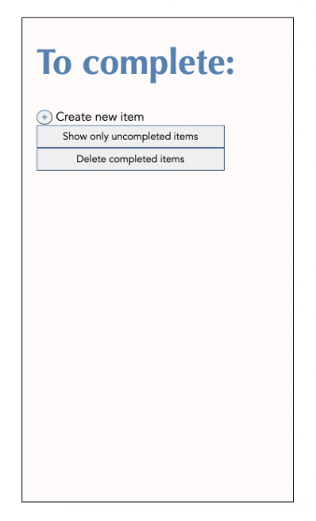

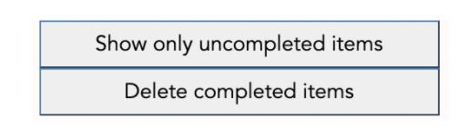

_Original orientation of buttons; touching, off center, and too high up near list items_

After much trial and error, and help from Grutor Jess, we were able to  bottom center and separate the two buttons. We also added a few last touches: light shadows underneath the buttons and pencil icons next to each list item. 

_Buttons are separated and have shadows_

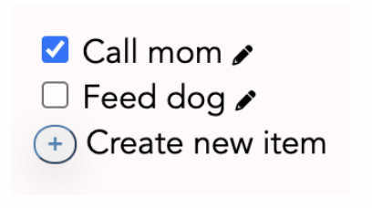

_Pencil icon to indicate that list items can be edited _

We would also like to address our design choices in _Task 5: Show Only Uncompleted Items. _

_The state of the screen at the beginning of the task_

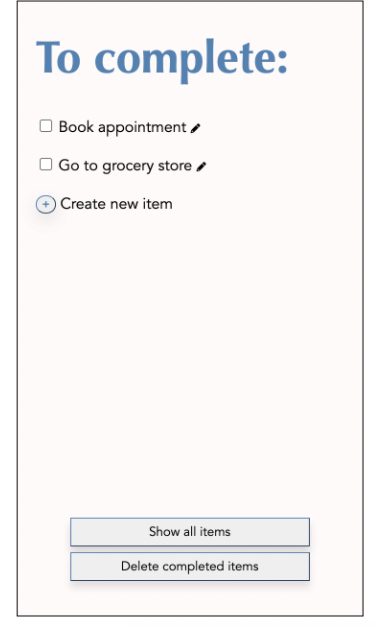

_This is the state of the screen at the end of the task_

Here, we decided to make the completed items disappear but still keep their original spaces, as well as transforming the “Show only uncompleted items” button to “Show all items” to give the user the option of seeing the items yet again. 

This design process was a great introduction to CSS and HTML. While this lab required lots of trouble-shooting, editing, and creativity, it was satisfying to see everything come together at the end. We are grateful for having user feedback from peers, grutors, our professor, and each other in our design process flow. 
