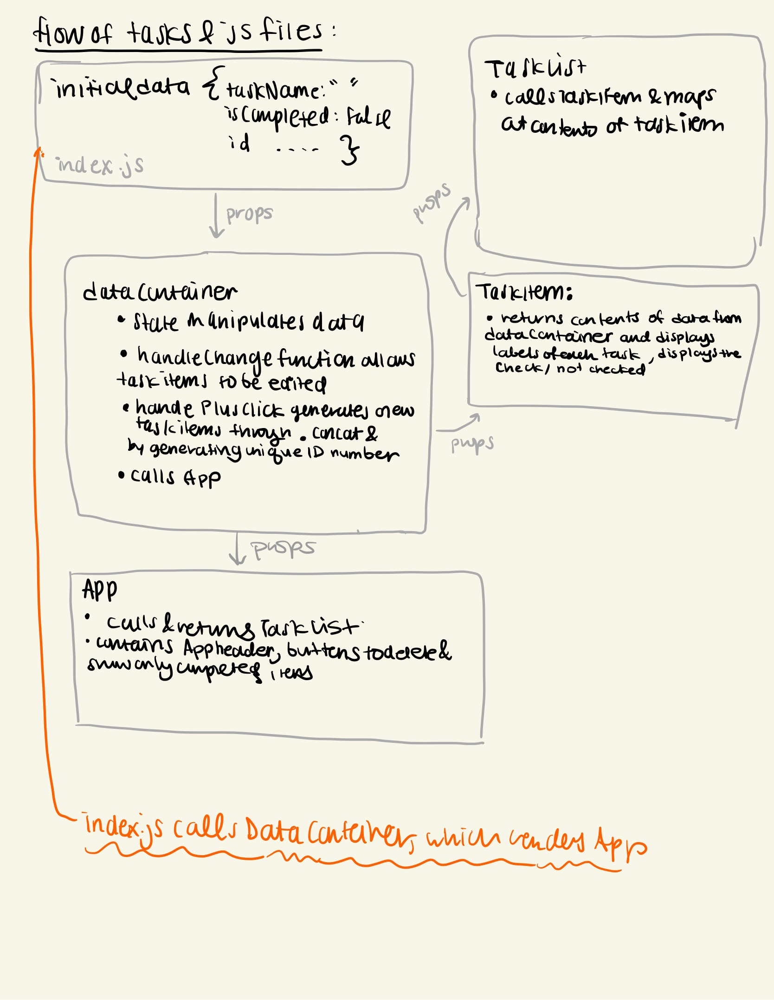

Megan Maley

Betsy Ding

Lab 2 Design Document 

For Lab 2, we decided to keep many of the original elements from our design in Lab 1. From Lab 1, we carried over the alignment and fonts of the text, including the header and list items, as well as the purple and blue theme, and the button orientation. These design choices were based on Dr. Milburn’s lecture on using only 2-3 colors, 2-3 font choices, and the Western appeal of left alignment. 

With the design from Lab 1 in mind, as well as our original interface inspirations (the Notes App and Kaiser App), we made several alterations: we made the background white to cultivate a cleaner UI, added a pencil emoji into the header for a whimsy touch, made the text boxes invisible, and changed the text of the button “Hide completed items/show all items” to be more concise. These various design elements were added both by copying the CSS from Lab 1 into App.js, as well as adding additional CSS throughout Lab 2 as we deemed fit. 

After refining our code and design, testing different elements as users ourselves and using the console to troubleshoot, we were able to share our design with peers to conduct user testing. 

<table>
  <tr>
   <td><strong>Participant #</strong>
   </td>
   <td><strong>Name of Participant</strong>
   </td>
   <td><strong>Verbal Feedback Notes</strong>
   </td>
  </tr>
  <tr>
   <td><strong>1</strong>
   </td>
   <td><strong>Annie</strong>
   </td>
   <td>
<ul>

<li>Thought that it was whimsical 

<li>Would like to be more colorful

<li>Added a bunch of tasks and didn’t like the overlap of the buttons on the bottom
</li>
</ul>
   </td>
  </tr>
  <tr>
   <td><strong>2</strong>
   </td>
   <td><strong>Mariana</strong>
   </td>
   <td>
<ul>

<li>Thought it was pretty straightforward to use

<li>Enjoyed the simplicity of the design

<li>Would like there to be more clarity when each task is saved (enter button to save instead of clicking out of the task) 

<li>Generally had a good impression of the interface
</li>
</ul>
   </td>
  </tr>
  <tr>
   <td><strong>3</strong>
   </td>
   <td><strong>Marcos</strong>
   </td>
   <td>
<ul>

<li>Likes the minimal design

<li>Should we some signal how to edit 
<ul>
 
<li>Suggested the pencil icon
</li> 
</ul>

<li>What about long texts?

<li>Replace click to edit with “new task”

<li>Might consider visual boundary between tasks, but personal preference

<li>Likes the emoji
</li>
</ul>
   </td>
  </tr>
  <tr>
   <td><strong>4</strong>
   </td>
   <td><strong>Michelle</strong>
   </td>
   <td>
<ul>

<li>What a fun list title and pencil 

<li>Enjoys the hover functionality

<li>A little undesirable that you have to delete placeholder

<li>No mechanism to delete items
</li>
</ul>
   </td>
  </tr>
</table>

**Challenges**: One of the biggest challenges we faced was not from the code, but from working within the git repository. Unbeknownst to us, we somehow cloned a repository with no remote connection to Github. We were confused why the changes were not reflected on github repo, but luckily we were able to resolve the issue with the help of Grutor Marcos by examining the origin of the repository and transferring the files into the correct repository connected to Github. 

Another challenge we faced was working with the plus-button to add new task items. We repeatedly got a compilation error and were unable to identify the issue for several days. We used print statements and comments to isolate the problem, and discovered that the issue was not due to our implementation, but rather mixing up the names of our handleChange function. Through this experience we learned the importance of getting new perspectives and naming functions meaningfully and properly.

We also experienced several minor challenges with the buttons used to delete items and change which items are displayed on the screen depending on completion. We resolved the issues by introducing a new state which keeps track of which data items are currently being displayed and restructuring where some of the states and handle change functions reside across components. 

**What we’re most proud of**: We spent a significant amount of time brainstorming the structure of our app before we started coding. This certainly helped both our workflow and comprehension of the class material. Nailing down the hierarchy of the components and the props between them was difficult, but the most rewarding in the end. Having a clear structure in mind allowed us to know which parts of the code and design to work on first and how to handle different elements and components and understand how props are passed onto different functions, files, and the use of states. While we worked on the code, we slowly altered our original vision of the organization of the components to fit the different functions we wrote. These are the diagrams that we created to organize our thoughts: 

